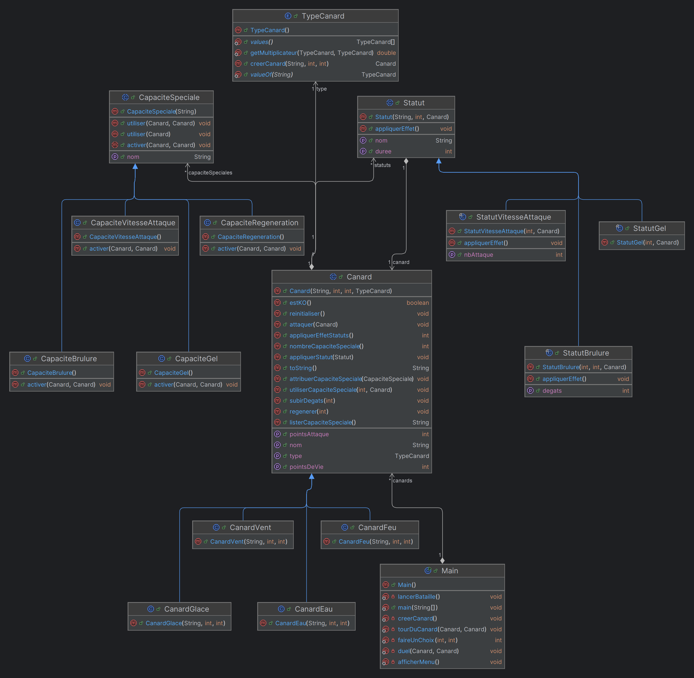

# Diagramme de classe

# Choix techniques
* Division en 3 packages pour mieux se repérer dans le code source (canard, capacite et statut)
* Des classes abstraites pour décrire chaque partie et que chaque chose ait le même fonctionnement.
* Une liste pour les capacités spéciales pour une potentiel évolution ou les canards évolueraient et obtiendraient de nouvelles capacités.

